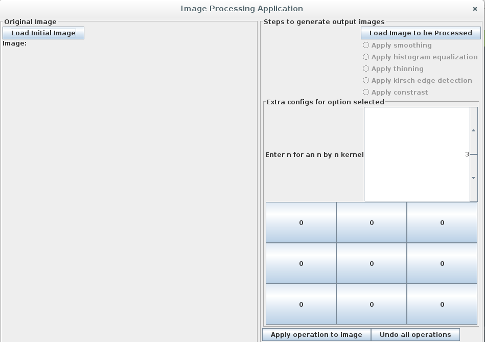

# README

## Image Processing GUI

**This is a tentative readme. Changes will be added at random and without warning. Use at your own risk!!!**

### Use of the GUI

If you are just stumbling on this repository, do this

> git clone -b develop https://github.com/Somnibyte/IdentifyBox.git 

That repository will have the latest commits.

If you want a more mature tested version of this 

> git clone https://github.com/Somnibyte/IdentifyBox.git 

To run, do these steps:

>compile:	javac ImageProcessGUI.java

>run: 		java ImageProcessGUI

### Initial screen

The first screen is shown below:

1. The first button on the left("Load Image to be Compared Against") is to load an image from the input folder into the application. It loads the image into 
the empty Label. Note the image dimensions have been resized to 500 by 500px. 

2. The second button on the right("Load Image to be Processed") is to load the image from the left or a new image to be processed by the operations associated with the radio buttons below it.

3. The extras panel contains the kernel in a n by n grid indicated by the number in the input box.("Enter n for an n by n kernel")

4. The ApplyOperation button applies the selected operation to the image and displays the output in another dialog. Then you are given a choice to save or to not save. If you save, the saved image goes to the output folder.

### TODO

- [x] Build an initial GUI
- [x] Implement simple operations, constrast, smoothing
- [x] Implement histogram equalization
- [x] Refactor initial GUI.
- [ ] Implement edge detection
- [ ] Implement Hough transform
- [ ] Add modes to GUI(automatic and manual)
- [ ] Refactor GUI.
- [ ] Write better README.
- [ ] Deploy as jar and Docker/Snap image.

#### ISSUES

Submit an issue and we would get to it as fast as possible. 

